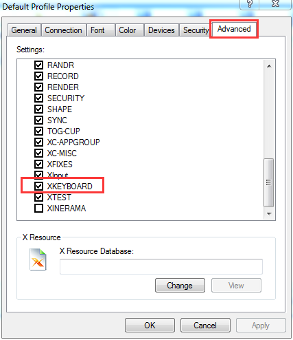

- Enable EPEL Repository:

```shell
wget http://dl.fedoraproject.org/pub/epel/7/x86_64/e/epel-release-7-6.noarch.rpm
rpm -ivh epel-release-7-6.noarch.rpm
```

- install `lightdm`, `xfce` and configure it:

```shell
su -
yum install lightdm && yum groupinstall xfce
vi /etc/lightdm/lightdm.conf
窶義``
[XDMCPServer]
enabled=true
user-session=xfce
窶義``
```

- change the default display manager to `lightdm`

```shell
systemctl disable gdm && systemctl enable lightdm
systemctl stop gdm && systemctl start lightdm
systemctl stop firewalld.service
```

----

- QtCreator open failed, reporting: `Assertion !xcb_xlib_too_much_data_requested' failed.`

```shell
vi ~/.local/share/applications/DigiaQt-qtcreator-community.desktop
窶義``
Exec=xxx - noload Welcome
窶義``
```

----

- Qt: XKEYBOARD extension not present on the X server.

 